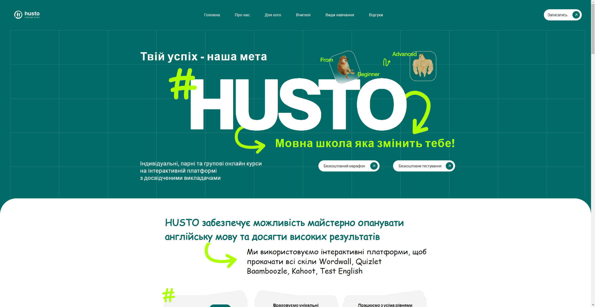

# Husto Language Studio

## Description of the project:
Husto Language Studio: An English school website showcasing learning opportunities, course offerings, and enrollment information. Designed for easy navigation and user engagement.

## Discover the website!
[Check it out!](some_link)

## Technologies used:
In this project our team used the following technologies:

### Backend
You can check the [Backend README.md](backend/README.md)
- Python
- Django ORM
- Django
- Django REST Framework
- Docker

### Frontend
You can check the [Frontend README.md](frontend/README.md)
- JavaScript
- React
- Typescript
- Scss
- Figma

### Design
Check the [Figma Design]()
- Figma
- Adobe Photoshop

## Description main features:

- **Simple and User-Friendly Interface**:
  The website features an intuitive design for easy navigation and user interaction.

- **Course Management**:
  Easily browse and manage course offerings, including detailed information about each course.

- **Course Signup**:
  Streamlined process for users to enroll in courses

## GitHub Page of the Project
[You can check it out!](https://team94mate.github.io/husto_language_studio/)

## Screenshots:

