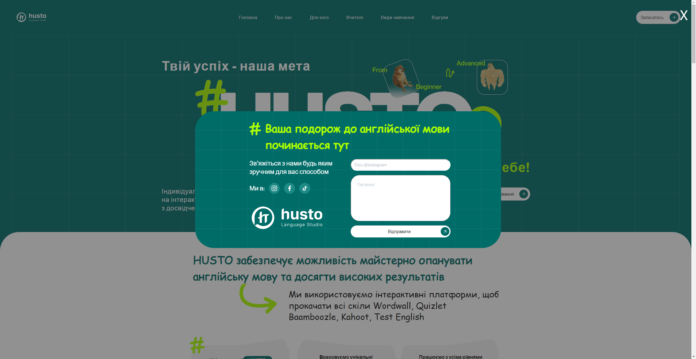
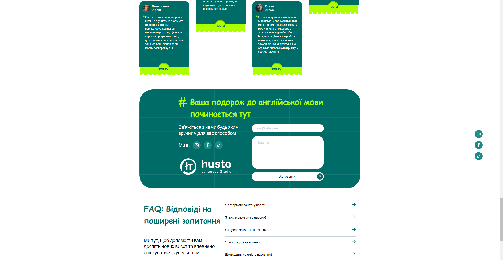

# Husto Language Studio

## Description:
Husto Language Studio is an English school website that provides information about courses, registration options, pricing, feedback, and an FAQ section.

## Discover the website!
[Check it out!](some_link)

## Technologies used:
In this project our team used the following technologies:

### Backend
You can check the [Backend README.md](backend/README.md)
- Python
- Django ORM
- Django
- Django REST Framework
- Docker

### Frontend
You can check the [Frontend README.md](frontend/README.md)
- JavaScript
- React
- Typescript
- Scss
- Figma

### Design
Explore the [Figma Design](https://www.figma.com/design/driXkAJFNb7fWjbvXJnsAh/Husto-language-school?node-id=0-1&t=xlzbrgMUzBRIj85F-1)
- Figma
- Adobe Photoshop

## Main features:
- **User-Friendly Interface**:
  The website features an intuitive design for easy navigation and user interaction.
---

- **Course Management**:
  Users can easily browse course offerings and view detailed course information.
---

- **Course Signup**:
  Streamlined process for users to enroll in courses.

## GitHub Page of the Project
[You can check it out!](https://team94mate.github.io/husto_language_studio/)

## Screenshots:
### Home Page

### Registrations

## License
This project is licensed under the [Apache License 2.0](LICENSE).
