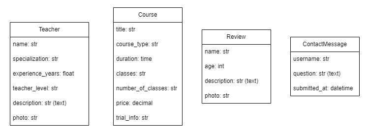

# Husto Language Studio

## Description of the project:
Husto Language Studio: An English school website showcasing learning opportunities, course offerings, and enrollment information. Designed for easy navigation and user engagement.

## Discover the website!

[Check it out!](some_link)

## Technologies used:
In this project our team used the following technologies:
### Backend
- Python
- Django
- Django ORM
- DRF

### Frontend
- JavaScript

### Design
- Figma

## Description main features:

- **Simple and User-Friendly Interface**:
  The website features an intuitive design for easy navigation and user interaction.

- **Course Management**:
  Easily browse and manage course offerings, including detailed information about each course.

- **Course Signup**:
  Streamlined process for users to enroll in courses

## Screenshots:

## Database structure:

