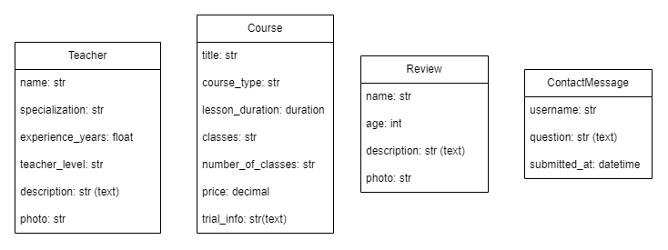
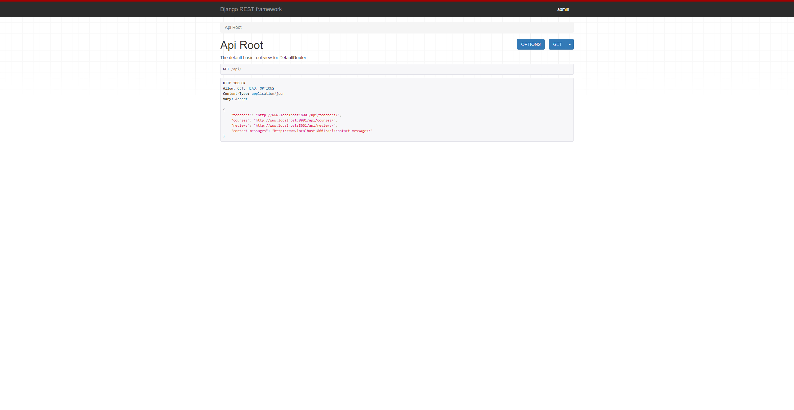
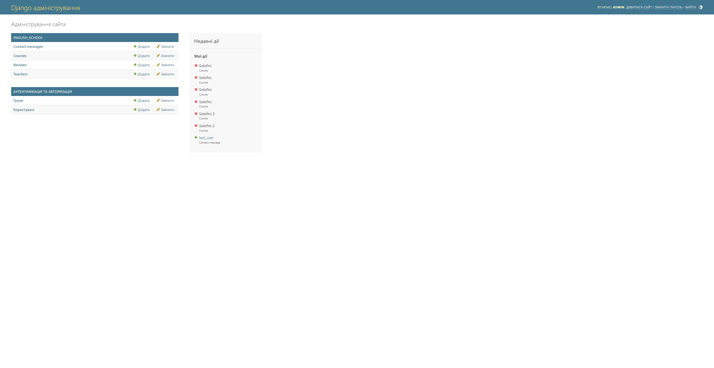
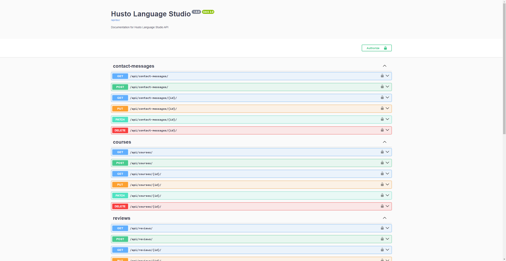

# Backend

## Description
A Django RESTful API for managing courses, contact messages, and reviews for a theatre.

### Main Features:
- **Purpose:** The API provides a robust backend for managing operations, including course management and user feedback.
- **Admin Page:** Provides a user-friendly interface for managing courses, contact messages, reviews, and teachers.
- **Testing:** Comprehensive test suite ensuring functionality and reliability of the API.


## Setup
To install the project locally on your computer, execute the following commands in a terminal:
```bash
git clone https://github.com/Team94Mate/husto_language_studio.git
cd husto_language_studio
python -m venv venv
venv\Scripts\activate (on Windows)
source venv/bin/activate (on macOS)
cd backend
pip install -r requirements.txt
```

## Environment Variables
Create a `.env` file in the root directory of the project. Use the [sample.env](sample.env) file as a reference to add the necessary configurations.


## Testing
Run the following commands to execute tests and check code style (You should be in backend dir):
```bash
cd backend
python manage.py test
flake8
 ```


## Docker Setup and Run
To set up and run the project using [Docker](https://www.docker.com/get-started/), follow these steps:

- Use http://localhost:8001/api URL to check backend API basic root.
- Use http://localhost:3000/ URL to visit the frontend service.

1. **Ensure Docker is Running**:
    ```text
    Make sure Docker Desktop is installed and running on your system.
    ```
   
2. **Start the Services**:
    ```bash
    docker-compose up
    ```

3. **Stop the Services if needed**:
   ```text
   Press Ctrl + C in the terminal to stop the services.
   ```


## API Endpoints

### Documentation Links
- **Installation Documentation**: `/api/doc/` - Installation documentation.
- **API Documentation**: `/api/doc/swagger/` - Interactive API documentation.

### Contact Messages
- **GET** `/api/contact-messages/`: Retrieve a list of contact messages.
- **POST** `/api/contact-messages/`: Create a new contact message.
- **GET** `/api/contact-messages/{id}/`: Retrieve a specific contact message by ID.
- **PUT** `/api/contact-messages/{id}/`: Update a specific contact message by ID.
- **PATCH** `/api/contact-messages/{id}/`: Partially update a specific contact message by ID.
- **DELETE** `/api/contact-messages/{id}/`: Delete a specific contact message by ID.

### Courses
- **GET** `/api/courses/`: Retrieve a list of courses.
- **POST** `/api/courses/`: Create a new course.
- **GET** `/api/courses/{id}/`: Retrieve a specific course by ID.
- **PUT** `/api/courses/{id}/`: Update a specific course by ID.
- **PATCH** `/api/courses/{id}/`: Partially update a specific course by ID.
- **DELETE** `/api/courses/{id}/`: Delete a specific course by ID.

### Reviews
- **GET** `/api/reviews/`: Retrieve a list of reviews.
- **POST** `/api/reviews/`: Create a new review.
- **GET** `/api/reviews/{id}/`: Retrieve a specific review by ID.
- **PUT** `/api/reviews/{id}/`: Update a specific review by ID.
- **PATCH** `/api/reviews/{id}/`: Partially update a specific review by ID.
- **DELETE** `/api/reviews/{id}/`: Delete a specific review by ID.

### Teachers
- **GET** `/api/teachers/`: Retrieve a list of teachers.
- **POST** `/api/teachers/`: Create a new teacher.
- **GET** `/api/teachers/{id}/`: Retrieve a specific teacher by ID.
- **PUT** `/api/teachers/{id}/`: Update a specific teacher by ID.
- **PATCH** `/api/teachers/{id}/`: Partially update a specific teacher by ID.
- **DELETE** `/api/teachers/{id}/`: Delete a specific teacher by ID.


## Screenshots






